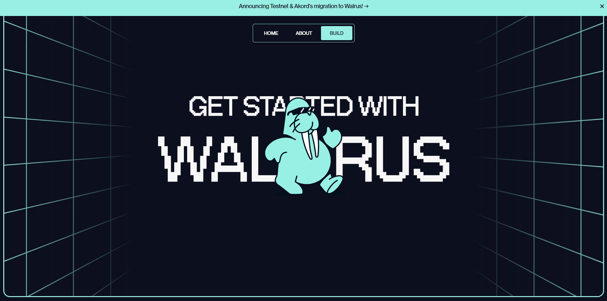

# WALRUS TESTNET BOT



The Walrus Testnet Bot is a powerful tool designed for interacting with SUI Testnet networks. This bot automates transaction processes, enabling users to perform actions such as Swapping between SUI and WAL, Stake to a Node Operator and Request Faucet seamlessly and daily making it an ideal solution for you to do your Walrus Testnet Airdrop.

## Prerequisite

- Git
- Node JS (v22)

## WALRUS TESTNET AIRDROP

Walrus Protocol Potential Testnet
Network : SUI

- Connect new SUI Wallet : [SUI Wallet](https://stake.walrus.site) (Testnet) - Get faucet : [Faucet](https://discord.com/invite/sui)
- Exchange SUI to WAL
- Stake 
- Done

## BOT FEATURE

- Multi Account 
- Support PK
- HTTP & SOCKS5 proxy support
- Auto Request Faucet
- Auto Swap both SUI and WAL
- Auto Stake
- Auto Mint 1 Flatlander NFT


## SETUP & CONFIGURE BOT

### LINUX

1. Clone project repository
   ```
   git clone https://github.com/Rambeboy/walrus-testnet-bot.git && cd walrus-testnet-bot
   ```
2. Install Dependecies and Setup Bot
   ```
   npm install && npm run setup
   ```
3. Configure your accounts
   ```
   nano accounts/accounts.js
   ```
4. Configure the bot config
    ```
   nano config/config.js
    ```
5. Configure the proxy 
    ```
   nano config/proxy_list.js
    ```
6. To run bot
   ```
   npm run start
   ```
   
### WINDOWS

1. Open your `Command Prompt` or `Power Shell`.

2. Clone project repository
   ```
   git clone https://github.com/Rambeboy/walrus-testnet-bot.git
   ```
   and cd to project dir
   ```
   cd walrus-testnet-bot
   ```
3. Install Dependencies and Setup Bot 
   ```
   npm install && npm run setup
   ```
4. Open `accounts/accounts.js` to configure your accounts

5. Open `config/proxy_list.js` to configure your proxy

6. Open `config/config.js` to configure bot Config

7. To start the app open your `Command Prompt` or `Power Shell`

8. To run auto Tx Bot
   ```
   npm run start
   ```

## UPDATE BOT

To update bot follow this step :

1. Run
   ```
   git pull
   ```
   or
   ```
   git pull --rebase
   ```
   if error run
   ```
   git stash && git pull
   ```
2. Run
   ```
   npm update
   ```
2. Start the bot

## CONTRIBUTE

Feel free to fork and contribute adding more feature thanks.

## LICENSE

This project is licensed under the MIT License - see the [LICENSE](LICENSE) file for details.

---